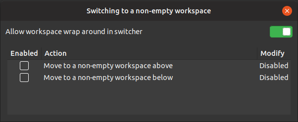

# Switching to a non-empty workspace
GNOME shell extensions for switching between non-empty workspaces also allow workspace wrap around in switcher.
When switching workspaces, going down from the bottom workspace switches to the top workspace. Likewise,
up from the top workspace goes to the bottom workspace.

## Settings

## License

[MIT](LICENSE)